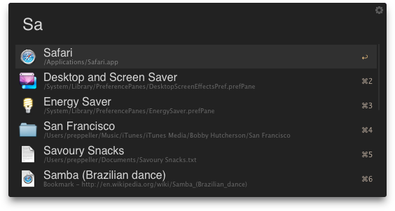

Rayless
=======

Rayless is a subtle dark theme for [Alfred 2](http://www.alfredapp.com)

### Requirements

In order to import and use this theme, you need to meet the requirements below
    
- [Alfred 2](http://www.alfredapp.com "Alfred App Website")
- [Alfred Powerpack](http://www.alfredapp.com/powerpack "Alfred Powerpack Website")

### Install

1. Download or `git clone` this repository
2. Double-click on the appearance file to import into Alfred 2

or simply [click here to install](alfred://theme/searchForegroundColor=rgba(214,214,214,1.00\)&resultSubtextFontSize=0&searchSelectionForegroundColor=rgba(255,255,255,1.00\)&separatorColor=rgba(69,69,69,0.00\)&resultSelectedBackgroundColor=rgba(48,48,48,1.00\)&shortcutColor=rgba(185,170,155,1.00\)&scrollbarColor=rgba(48,48,48,1.00\)&imageStyle=8&resultSubtextFont=Lucida%20Grande&background=rgba(34,34,34,1.00\)&shortcutFontSize=0&searchFontSize=2&resultSubtextColor=rgba(103,103,103,1.00\)&searchBackgroundColor=rgba(255,255,255,0.00\)&name=Rayless&resultTextFontSize=2&resultSelectedSubtextColor=rgba(130,130,130,1.00\)&shortcutSelectedColor=rgba(232,190,117,1.00\)&widthSize=2&border=rgba(0,0,0,0.00\)&resultTextFont=Helvetica&resultTextColor=rgba(214,214,214,1.00\)&cornerRoundness=3&searchFont=Helvetica&searchPaddingSize=0&credits=Humanoidism&searchSelectionBackgroundColor=rgba(102,122,140,1.00\)&resultSelectedTextColor=rgba(214,214,214,1.00\)&resultPaddingSize=0&shortcutFont=Monaco "Download Rayless Theme")